Author: StatsEye - Klaudia Łubian

Date: September 2019

# Predicting churn with XGBoost

This notebook demonstrates how to use *XGBoost* to predict churn of an individual using pre-processed dataset on 10,000 customers. This Python code includes advanced parameter tuning and explanation of the final model's predictions using SHAP values plotted with the *shap* library. 

Gradient boosting machine methods such as XGBoost are state-of-the-art for these types of prediction problems with tabular style input data of many modalities. XGBoost is used nowadays to create some of the most performant prediction models. Tree SHAP allows for fast and exact computation of SHAP values for tree ensemble methods, and has been integrated directly into the C++ XGBoost code base. Here I will demonstrate how to use SHAP values to understand XGBoost model predictions.

# 1. Set up


```python
# Import libraries
import os
import numpy as np
import pandas as pd
from sklearn.preprocessing import LabelEncoder, OneHotEncoder
from sklearn.model_selection import GridSearchCV
from sklearn.model_selection import cross_val_score
from sklearn.model_selection import train_test_split
import xgboost as xgb
from xgboost import XGBClassifier
from sklearn import metrics
import shap
import pickle
import matplotlib.pyplot as plt
from matplotlib.pylab import rcParams

# Configure plotting
rcParams['figure.figsize'] = 12, 6
%matplotlib inline

# Allow showing all columns in the output
pd.set_option('display.expand_frame_repr', False)
```

# 2. Data management

## Import dataset and select variables for modelling


```python
# Import data
dataset = pd.read_csv('data/Churn_Modelling.csv')

# Basic info about the variables
print(dataset.info())
```

    <class 'pandas.core.frame.DataFrame'>
    RangeIndex: 10000 entries, 0 to 9999
    Data columns (total 14 columns):
    RowNumber          10000 non-null int64
    CustomerId         10000 non-null int64
    Surname            10000 non-null object
    CreditScore        10000 non-null int64
    Geography          10000 non-null object
    Gender             10000 non-null object
    Age                10000 non-null int64
    Tenure             10000 non-null int64
    Balance            10000 non-null float64
    NumOfProducts      10000 non-null int64
    HasCrCard          10000 non-null int64
    IsActiveMember     10000 non-null int64
    EstimatedSalary    10000 non-null float64
    Exited             10000 non-null int64
    dtypes: float64(2), int64(9), object(3)
    memory usage: 1.1+ MB
    None
    


```python
# First three columns are not needed for modelling. Drop them from the dataset
dataset = dataset.iloc[:, 3:]
```

### Encoding of categorical data
Note that XGBoost does not support categorical features


```python
# Check categories of categorical variables
print("Categories of Gender:", dataset["Gender"].unique())
print("Categories of Geography:", dataset["Geography"].unique())
```

    Categories of Gender: ['Female' 'Male']
    Categories of Geography: ['France' 'Spain' 'Germany']
    


```python
# Transform Gender column (create dummies)
labelencoder_X_2 = LabelEncoder()
dataset["Gender"] = labelencoder_X_2.fit_transform(dataset["Gender"])
dataset["Gender"].unique()
print(dataset.info())
print("Categories of Gender:", dataset["Gender"].unique())
```

    <class 'pandas.core.frame.DataFrame'>
    RangeIndex: 10000 entries, 0 to 9999
    Data columns (total 11 columns):
    CreditScore        10000 non-null int64
    Geography          10000 non-null object
    Gender             10000 non-null int32
    Age                10000 non-null int64
    Tenure             10000 non-null int64
    Balance            10000 non-null float64
    NumOfProducts      10000 non-null int64
    HasCrCard          10000 non-null int64
    IsActiveMember     10000 non-null int64
    EstimatedSalary    10000 non-null float64
    Exited             10000 non-null int64
    dtypes: float64(2), int32(1), int64(7), object(1)
    memory usage: 820.4+ KB
    None
    Categories of Gender: [0 1]
    


```python
# Transform Geography column (create dummies)
dataset['Spain'] = (dataset['Geography'] == 'Spain').map({True: '1', False: '0'})
dataset['Spain']=dataset['Spain'].astype(int)
dataset['Germany'] = (dataset['Geography'] == 'Germany').map({True: '1', False: '0'})
dataset['Germany']=dataset['Germany'].astype(int)
del dataset["Geography"]
print(dataset.info())
```

    <class 'pandas.core.frame.DataFrame'>
    RangeIndex: 10000 entries, 0 to 9999
    Data columns (total 12 columns):
    CreditScore        10000 non-null int64
    Gender             10000 non-null int32
    Age                10000 non-null int64
    Tenure             10000 non-null int64
    Balance            10000 non-null float64
    NumOfProducts      10000 non-null int64
    HasCrCard          10000 non-null int64
    IsActiveMember     10000 non-null int64
    EstimatedSalary    10000 non-null float64
    Exited             10000 non-null int64
    Spain              10000 non-null int32
    Germany            10000 non-null int32
    dtypes: float64(2), int32(3), int64(7)
    memory usage: 820.4 KB
    None
    

## Splitting dataset into training and test set

Ideally, the model should be evaluated on samples that were not used to build or fine-tune the model, so that they provide an unbiased sense of model effectiveness. When a large amount of data is at hand, a set of samples can be set aside to evaluate the final model. The training dataset is the general term for the samples used to create the model, while the test or validation data set is used to qualify performance.
Generally, the term *validation set* is used interchangeably with the term *test set* and refers to a sample of the dataset held back from training the model. I will use the terms following the glossary in Brian Ripley’s book (1996) *Pattern Recognition and Neural Networks*:
* Training set: A set of cases used for learning, that is to fit the parameters of the classifier.
* Validation set: A set of cases used to tune the parameters of a classifier, for example to choose the number of hidden units in a neural network.
* Test set: A set of cases used only to assess the performance of a fully-specified classifier.


```python
# Check proportion of cases with churn=1 in the whole dataset 
print(dataset['Exited'].sum() / len(dataset) * 100 )
# no high imbalance of the target class, so no need to adjust scale_pos_weight parameter in XGBoost
```

    20.369999999999997
    


```python
# Split target variables and predictors
y = dataset['Exited']
X = dataset.drop(['Exited'],axis=1)

X_train, X_test, y_train, y_test = train_test_split(X, y, test_size = 0.2, random_state = 123, stratify = y)
print("Number of cases in training dataset:", len(y_train))
print("Number of cases in test dataset:", len(y_test))
```

    Number of cases in training dataset: 8000
    Number of cases in test dataset: 2000
    


```python
# Check if stratification worked 
print("% of Exited in training dataset:", y_train.sum()/ len(y_train) * 100.0)
print("% of Exited in test dataset:", y_test.sum() / len(y_test) * 100.0 )
# there is a similar proportion of cases with churn=1 in two datasets - good!
```

    % of Exited in training dataset: 20.375
    % of Exited in test dataset: 20.349999999999998
    

# 3. XGBoost modelling

## 3.1 Use default values for parameters in order to decide on number of trees for XGBoost
In order to decide on optimal boosting parameters, we need to set some initial values of other parameters. Lets take the default learning rate of 0.1 here and check the optimum number of trees using cv function of xgboost.

Default parameters for class xgboost.XGBClassifier: 
*(max_depth=3, learning_rate=0.1, n_estimators=100, verbosity=1, silent=None, objective='binary:logistic', booster='gbtree', n_jobs=1, nthread=None, gamma=0, min_child_weight=1, max_delta_step=0, subsample=1, colsample_bytree=1, colsample_bylevel=1, colsample_bynode=1, reg_alpha=0, reg_lambda=1, scale_pos_weight=1, base_score=0.5, random_state=0, seed=None, missing=None)*

Documentation on parameters:(https://xgboost.readthedocs.io/en/latest/parameter.html)

I use the tree booster and logistic regression objective in modelling. This indicates that I'll accomplish the task using classic *gradient boosting regression tree* (GBRT), which is a promising method for binary classification.
Though there are 3 types of boosters (gbtrea, dart and gblinear), I’ll consider only tree booster here because it always outperforms the linear booster, while dart is rarely used.

I will fit the initial model and qualify its performance using test dataset and *accuracy* measure. This will serve as a benchmark for comparison with the performance of the final model (once all parameters are optimized). This also allows to use *early_stopping_rounds* option which will help me decide on number of trees necessary for further modelling. 


```python
xgb1 =  XGBClassifier(
 learning_rate =0.1,
 n_estimators=500,
 objective= 'binary:logistic',
 random_state=123)

print("Set early_stopping_rounds to 10% of the size of the training dataset:", 0.01*(len(X_train)))

xgb1.fit(X_train, y_train, 
         eval_set=[(X_train, y_train), (X_test, y_test)],
         eval_metric='auc',
         early_stopping_rounds = 0.01*(len(X_train)),
         verbose=True)
print(xgb1)

# We got 225 as an optimal number of estimators for 0.1 learning rate. Accuracy for the test dataset = 0.871. 
```

    Set early_stopping_rounds to 10% of the size of the training dataset: 80.0
    [0]	validation_0-auc:0.79252	validation_1-auc:0.810337
    Multiple eval metrics have been passed: 'validation_1-auc' will be used for early stopping.
    
    Will train until validation_1-auc hasn't improved in 80.0 rounds.
    [1]	validation_0-auc:0.793496	validation_1-auc:0.811425
    [2]	validation_0-auc:0.797229	validation_1-auc:0.814404
    [3]	validation_0-auc:0.800978	validation_1-auc:0.817603
    [4]	validation_0-auc:0.80734	validation_1-auc:0.823439
    [5]	validation_0-auc:0.810101	validation_1-auc:0.825546
    [6]	validation_0-auc:0.821564	validation_1-auc:0.833427
    [7]	validation_0-auc:0.820742	validation_1-auc:0.83275
    [8]	validation_0-auc:0.829718	validation_1-auc:0.837489
    [9]	validation_0-auc:0.830888	validation_1-auc:0.838287
    [10]	validation_0-auc:0.83478	validation_1-auc:0.843464
    [11]	validation_0-auc:0.83518	validation_1-auc:0.844628
    [12]	validation_0-auc:0.835343	validation_1-auc:0.844805
    [13]	validation_0-auc:0.840297	validation_1-auc:0.847267
    [14]	validation_0-auc:0.841678	validation_1-auc:0.847485
    [15]	validation_0-auc:0.842301	validation_1-auc:0.849357
    [16]	validation_0-auc:0.845097	validation_1-auc:0.851117
    [17]	validation_0-auc:0.846979	validation_1-auc:0.851776
    [18]	validation_0-auc:0.848211	validation_1-auc:0.852635
    [19]	validation_0-auc:0.849635	validation_1-auc:0.854514
    [20]	validation_0-auc:0.852643	validation_1-auc:0.85711
    [21]	validation_0-auc:0.853535	validation_1-auc:0.858199
    [22]	validation_0-auc:0.855687	validation_1-auc:0.859557
    [23]	validation_0-auc:0.856669	validation_1-auc:0.860402
    [24]	validation_0-auc:0.85767	validation_1-auc:0.861314
    [25]	validation_0-auc:0.858207	validation_1-auc:0.861469
    [26]	validation_0-auc:0.861711	validation_1-auc:0.863174
    [27]	validation_0-auc:0.862305	validation_1-auc:0.863393
    [28]	validation_0-auc:0.862342	validation_1-auc:0.863391
    [29]	validation_0-auc:0.862836	validation_1-auc:0.863209
    [30]	validation_0-auc:0.863099	validation_1-auc:0.863531
    [31]	validation_0-auc:0.864821	validation_1-auc:0.864457
    [32]	validation_0-auc:0.866343	validation_1-auc:0.864829
    [33]	validation_0-auc:0.866752	validation_1-auc:0.865268
    [34]	validation_0-auc:0.867255	validation_1-auc:0.865748
    [35]	validation_0-auc:0.86804	validation_1-auc:0.865738
    [36]	validation_0-auc:0.869991	validation_1-auc:0.866228
    [37]	validation_0-auc:0.870202	validation_1-auc:0.866339
    [38]	validation_0-auc:0.870359	validation_1-auc:0.866454
    [39]	validation_0-auc:0.871361	validation_1-auc:0.866755
    [40]	validation_0-auc:0.871757	validation_1-auc:0.866705
    [41]	validation_0-auc:0.872046	validation_1-auc:0.866808
    [42]	validation_0-auc:0.872733	validation_1-auc:0.866545
    [43]	validation_0-auc:0.873328	validation_1-auc:0.866723
    [44]	validation_0-auc:0.873481	validation_1-auc:0.866875
    [45]	validation_0-auc:0.873794	validation_1-auc:0.867021
    [46]	validation_0-auc:0.874285	validation_1-auc:0.86736
    [47]	validation_0-auc:0.874773	validation_1-auc:0.867567
    [48]	validation_0-auc:0.875086	validation_1-auc:0.867301
    [49]	validation_0-auc:0.875451	validation_1-auc:0.86721
    [50]	validation_0-auc:0.875792	validation_1-auc:0.867323
    [51]	validation_0-auc:0.875777	validation_1-auc:0.867311
    [52]	validation_0-auc:0.87613	validation_1-auc:0.867699
    [53]	validation_0-auc:0.876697	validation_1-auc:0.867965
    [54]	validation_0-auc:0.876838	validation_1-auc:0.868035
    [55]	validation_0-auc:0.877119	validation_1-auc:0.868084
    [56]	validation_0-auc:0.877258	validation_1-auc:0.868102
    [57]	validation_0-auc:0.877537	validation_1-auc:0.868249
    [58]	validation_0-auc:0.877723	validation_1-auc:0.868712
    [59]	validation_0-auc:0.877946	validation_1-auc:0.868274
    [60]	validation_0-auc:0.878103	validation_1-auc:0.868319
    [61]	validation_0-auc:0.878052	validation_1-auc:0.868432
    [62]	validation_0-auc:0.878531	validation_1-auc:0.868471
    [63]	validation_0-auc:0.878707	validation_1-auc:0.86836
    [64]	validation_0-auc:0.878887	validation_1-auc:0.868447
    [65]	validation_0-auc:0.879134	validation_1-auc:0.868644
    [66]	validation_0-auc:0.879162	validation_1-auc:0.868607
    [67]	validation_0-auc:0.879291	validation_1-auc:0.86857
    [68]	validation_0-auc:0.879659	validation_1-auc:0.868702
    [69]	validation_0-auc:0.879723	validation_1-auc:0.868707
    [70]	validation_0-auc:0.879761	validation_1-auc:0.868766
    [71]	validation_0-auc:0.879872	validation_1-auc:0.868613
    [72]	validation_0-auc:0.880023	validation_1-auc:0.868407
    [73]	validation_0-auc:0.880191	validation_1-auc:0.868756
    [74]	validation_0-auc:0.880477	validation_1-auc:0.86887
    [75]	validation_0-auc:0.880495	validation_1-auc:0.868915
    [76]	validation_0-auc:0.880462	validation_1-auc:0.86884
    [77]	validation_0-auc:0.880557	validation_1-auc:0.868491
    [78]	validation_0-auc:0.880967	validation_1-auc:0.868358
    [79]	validation_0-auc:0.881327	validation_1-auc:0.868433
    [80]	validation_0-auc:0.881466	validation_1-auc:0.868455
    [81]	validation_0-auc:0.881496	validation_1-auc:0.868527
    [82]	validation_0-auc:0.881475	validation_1-auc:0.868515
    [83]	validation_0-auc:0.881466	validation_1-auc:0.868513
    [84]	validation_0-auc:0.881561	validation_1-auc:0.868612
    [85]	validation_0-auc:0.8816	validation_1-auc:0.868557
    [86]	validation_0-auc:0.881939	validation_1-auc:0.868466
    [87]	validation_0-auc:0.881948	validation_1-auc:0.868464
    [88]	validation_0-auc:0.882047	validation_1-auc:0.868392
    [89]	validation_0-auc:0.882306	validation_1-auc:0.868296
    [90]	validation_0-auc:0.88233	validation_1-auc:0.868225
    [91]	validation_0-auc:0.882439	validation_1-auc:0.868291
    [92]	validation_0-auc:0.882818	validation_1-auc:0.868145
    [93]	validation_0-auc:0.883141	validation_1-auc:0.868375
    [94]	validation_0-auc:0.8832	validation_1-auc:0.868361
    [95]	validation_0-auc:0.883206	validation_1-auc:0.868343
    [96]	validation_0-auc:0.883507	validation_1-auc:0.868477
    [97]	validation_0-auc:0.883471	validation_1-auc:0.868351
    [98]	validation_0-auc:0.883691	validation_1-auc:0.868441
    [99]	validation_0-auc:0.883909	validation_1-auc:0.868446
    [100]	validation_0-auc:0.884211	validation_1-auc:0.868196
    [101]	validation_0-auc:0.88423	validation_1-auc:0.868174
    [102]	validation_0-auc:0.884316	validation_1-auc:0.868225
    [103]	validation_0-auc:0.884539	validation_1-auc:0.868633
    [104]	validation_0-auc:0.884738	validation_1-auc:0.868702
    [105]	validation_0-auc:0.884828	validation_1-auc:0.868523
    [106]	validation_0-auc:0.885174	validation_1-auc:0.868384
    [107]	validation_0-auc:0.885682	validation_1-auc:0.868834
    [108]	validation_0-auc:0.885885	validation_1-auc:0.868845
    [109]	validation_0-auc:0.886167	validation_1-auc:0.868944
    [110]	validation_0-auc:0.886352	validation_1-auc:0.868985
    [111]	validation_0-auc:0.886515	validation_1-auc:0.86899
    [112]	validation_0-auc:0.88663	validation_1-auc:0.869169
    [113]	validation_0-auc:0.886705	validation_1-auc:0.869229
    [114]	validation_0-auc:0.886785	validation_1-auc:0.869397
    [115]	validation_0-auc:0.886915	validation_1-auc:0.869231
    [116]	validation_0-auc:0.887125	validation_1-auc:0.86919
    [117]	validation_0-auc:0.887182	validation_1-auc:0.86923
    [118]	validation_0-auc:0.887293	validation_1-auc:0.869341
    [119]	validation_0-auc:0.887343	validation_1-auc:0.869191
    [120]	validation_0-auc:0.88759	validation_1-auc:0.869128
    [121]	validation_0-auc:0.887713	validation_1-auc:0.869097
    [122]	validation_0-auc:0.887833	validation_1-auc:0.869076
    [123]	validation_0-auc:0.887801	validation_1-auc:0.869018
    [124]	validation_0-auc:0.887883	validation_1-auc:0.86912
    [125]	validation_0-auc:0.887936	validation_1-auc:0.869219
    [126]	validation_0-auc:0.888288	validation_1-auc:0.869298
    [127]	validation_0-auc:0.888674	validation_1-auc:0.869425
    [128]	validation_0-auc:0.88884	validation_1-auc:0.869474
    [129]	validation_0-auc:0.888989	validation_1-auc:0.869477
    [130]	validation_0-auc:0.889069	validation_1-auc:0.869528
    [131]	validation_0-auc:0.88917	validation_1-auc:0.869439
    [132]	validation_0-auc:0.889271	validation_1-auc:0.869413
    [133]	validation_0-auc:0.889428	validation_1-auc:0.869393
    [134]	validation_0-auc:0.889517	validation_1-auc:0.869289
    [135]	validation_0-auc:0.889787	validation_1-auc:0.869443
    [136]	validation_0-auc:0.890069	validation_1-auc:0.869234
    [137]	validation_0-auc:0.890073	validation_1-auc:0.869317
    [138]	validation_0-auc:0.890132	validation_1-auc:0.869393
    [139]	validation_0-auc:0.890197	validation_1-auc:0.869277
    [140]	validation_0-auc:0.890423	validation_1-auc:0.869306
    [141]	validation_0-auc:0.8907	validation_1-auc:0.869072
    [142]	validation_0-auc:0.890798	validation_1-auc:0.869177
    [143]	validation_0-auc:0.891014	validation_1-auc:0.869354
    [144]	validation_0-auc:0.891296	validation_1-auc:0.869496
    [145]	validation_0-auc:0.891375	validation_1-auc:0.869426
    [146]	validation_0-auc:0.891386	validation_1-auc:0.869343
    [147]	validation_0-auc:0.891455	validation_1-auc:0.869317
    [148]	validation_0-auc:0.891527	validation_1-auc:0.869317
    [149]	validation_0-auc:0.891534	validation_1-auc:0.869325
    [150]	validation_0-auc:0.891809	validation_1-auc:0.869311
    [151]	validation_0-auc:0.891863	validation_1-auc:0.869317
    [152]	validation_0-auc:0.892125	validation_1-auc:0.869393
    [153]	validation_0-auc:0.892309	validation_1-auc:0.869404
    [154]	validation_0-auc:0.892507	validation_1-auc:0.869436
    [155]	validation_0-auc:0.892712	validation_1-auc:0.869518
    [156]	validation_0-auc:0.892989	validation_1-auc:0.869574
    [157]	validation_0-auc:0.893201	validation_1-auc:0.869609
    [158]	validation_0-auc:0.893293	validation_1-auc:0.869655
    [159]	validation_0-auc:0.893441	validation_1-auc:0.869753
    [160]	validation_0-auc:0.893548	validation_1-auc:0.869814
    [161]	validation_0-auc:0.893558	validation_1-auc:0.869713
    [162]	validation_0-auc:0.893572	validation_1-auc:0.869717
    [163]	validation_0-auc:0.893888	validation_1-auc:0.869588
    [164]	validation_0-auc:0.89396	validation_1-auc:0.869558
    [165]	validation_0-auc:0.894028	validation_1-auc:0.869487
    [166]	validation_0-auc:0.894157	validation_1-auc:0.869458
    [167]	validation_0-auc:0.894436	validation_1-auc:0.869612
    [168]	validation_0-auc:0.894537	validation_1-auc:0.869551
    [169]	validation_0-auc:0.894593	validation_1-auc:0.869577
    [170]	validation_0-auc:0.894643	validation_1-auc:0.869552
    [171]	validation_0-auc:0.894723	validation_1-auc:0.869611
    [172]	validation_0-auc:0.894896	validation_1-auc:0.869487
    [173]	validation_0-auc:0.895365	validation_1-auc:0.870038
    [174]	validation_0-auc:0.895922	validation_1-auc:0.870502
    [175]	validation_0-auc:0.896381	validation_1-auc:0.870832
    [176]	validation_0-auc:0.896386	validation_1-auc:0.870943
    [177]	validation_0-auc:0.896487	validation_1-auc:0.870903
    [178]	validation_0-auc:0.896635	validation_1-auc:0.870875
    [179]	validation_0-auc:0.896974	validation_1-auc:0.870818
    [180]	validation_0-auc:0.89711	validation_1-auc:0.8709
    [181]	validation_0-auc:0.897282	validation_1-auc:0.870868
    [182]	validation_0-auc:0.897558	validation_1-auc:0.870842
    [183]	validation_0-auc:0.897703	validation_1-auc:0.871014
    [184]	validation_0-auc:0.897672	validation_1-auc:0.870929
    [185]	validation_0-auc:0.897979	validation_1-auc:0.871169
    [186]	validation_0-auc:0.898274	validation_1-auc:0.871138
    [187]	validation_0-auc:0.898375	validation_1-auc:0.871095
    [188]	validation_0-auc:0.898492	validation_1-auc:0.871065
    [189]	validation_0-auc:0.898636	validation_1-auc:0.871098
    [190]	validation_0-auc:0.898718	validation_1-auc:0.871144
    [191]	validation_0-auc:0.898899	validation_1-auc:0.871062
    [192]	validation_0-auc:0.898941	validation_1-auc:0.871119
    [193]	validation_0-auc:0.899036	validation_1-auc:0.871269
    [194]	validation_0-auc:0.89916	validation_1-auc:0.871095
    [195]	validation_0-auc:0.899387	validation_1-auc:0.871116
    [196]	validation_0-auc:0.899464	validation_1-auc:0.871175
    [197]	validation_0-auc:0.899558	validation_1-auc:0.871107
    [198]	validation_0-auc:0.899886	validation_1-auc:0.871162
    [199]	validation_0-auc:0.899931	validation_1-auc:0.871235
    [200]	validation_0-auc:0.900091	validation_1-auc:0.871091
    [201]	validation_0-auc:0.900318	validation_1-auc:0.871122
    [202]	validation_0-auc:0.900478	validation_1-auc:0.871
    [203]	validation_0-auc:0.900639	validation_1-auc:0.871037
    [204]	validation_0-auc:0.900745	validation_1-auc:0.871182
    [205]	validation_0-auc:0.900856	validation_1-auc:0.871189
    [206]	validation_0-auc:0.901121	validation_1-auc:0.871293
    [207]	validation_0-auc:0.901566	validation_1-auc:0.871273
    [208]	validation_0-auc:0.901696	validation_1-auc:0.871172
    [209]	validation_0-auc:0.901869	validation_1-auc:0.871255
    [210]	validation_0-auc:0.902013	validation_1-auc:0.871136
    [211]	validation_0-auc:0.902054	validation_1-auc:0.871101
    [212]	validation_0-auc:0.902172	validation_1-auc:0.871077
    [213]	validation_0-auc:0.90222	validation_1-auc:0.871151
    [214]	validation_0-auc:0.902296	validation_1-auc:0.871175
    [215]	validation_0-auc:0.902632	validation_1-auc:0.871161
    [216]	validation_0-auc:0.902821	validation_1-auc:0.871149
    [217]	validation_0-auc:0.902909	validation_1-auc:0.87134
    [218]	validation_0-auc:0.902968	validation_1-auc:0.871369
    [219]	validation_0-auc:0.903071	validation_1-auc:0.871289
    [220]	validation_0-auc:0.903197	validation_1-auc:0.871273
    [221]	validation_0-auc:0.903304	validation_1-auc:0.871236
    [222]	validation_0-auc:0.90335	validation_1-auc:0.8713
    [223]	validation_0-auc:0.903657	validation_1-auc:0.871341
    [224]	validation_0-auc:0.903681	validation_1-auc:0.871338
    [225]	validation_0-auc:0.903719	validation_1-auc:0.871398
    [226]	validation_0-auc:0.9038	validation_1-auc:0.871243
    [227]	validation_0-auc:0.904036	validation_1-auc:0.871189
    [228]	validation_0-auc:0.904189	validation_1-auc:0.871076
    [229]	validation_0-auc:0.904411	validation_1-auc:0.871048
    [230]	validation_0-auc:0.904594	validation_1-auc:0.871164
    [231]	validation_0-auc:0.904852	validation_1-auc:0.871064
    [232]	validation_0-auc:0.905226	validation_1-auc:0.871196
    [233]	validation_0-auc:0.905354	validation_1-auc:0.871125
    [234]	validation_0-auc:0.905469	validation_1-auc:0.871056
    [235]	validation_0-auc:0.905794	validation_1-auc:0.871121
    [236]	validation_0-auc:0.90594	validation_1-auc:0.871179
    [237]	validation_0-auc:0.90612	validation_1-auc:0.871019
    [238]	validation_0-auc:0.906371	validation_1-auc:0.87113
    [239]	validation_0-auc:0.906431	validation_1-auc:0.871144
    [240]	validation_0-auc:0.906581	validation_1-auc:0.871266
    [241]	validation_0-auc:0.906631	validation_1-auc:0.871244
    [242]	validation_0-auc:0.90681	validation_1-auc:0.871149
    [243]	validation_0-auc:0.907052	validation_1-auc:0.87111
    [244]	validation_0-auc:0.90719	validation_1-auc:0.871016
    [245]	validation_0-auc:0.90722	validation_1-auc:0.87102
    [246]	validation_0-auc:0.907307	validation_1-auc:0.870976
    [247]	validation_0-auc:0.907437	validation_1-auc:0.87111
    [248]	validation_0-auc:0.907507	validation_1-auc:0.871149
    [249]	validation_0-auc:0.907691	validation_1-auc:0.871111
    [250]	validation_0-auc:0.907825	validation_1-auc:0.870987
    [251]	validation_0-auc:0.907858	validation_1-auc:0.871013
    [252]	validation_0-auc:0.907883	validation_1-auc:0.871048
    [253]	validation_0-auc:0.907992	validation_1-auc:0.871011
    [254]	validation_0-auc:0.908182	validation_1-auc:0.871118
    [255]	validation_0-auc:0.908349	validation_1-auc:0.871196
    [256]	validation_0-auc:0.908409	validation_1-auc:0.871229
    [257]	validation_0-auc:0.908598	validation_1-auc:0.871187
    [258]	validation_0-auc:0.908831	validation_1-auc:0.870899
    [259]	validation_0-auc:0.908973	validation_1-auc:0.870987
    [260]	validation_0-auc:0.909115	validation_1-auc:0.870903
    [261]	validation_0-auc:0.909252	validation_1-auc:0.870863
    [262]	validation_0-auc:0.909336	validation_1-auc:0.870923
    [263]	validation_0-auc:0.909425	validation_1-auc:0.871082
    [264]	validation_0-auc:0.909634	validation_1-auc:0.871002
    [265]	validation_0-auc:0.909842	validation_1-auc:0.87097
    [266]	validation_0-auc:0.909942	validation_1-auc:0.870877
    [267]	validation_0-auc:0.910037	validation_1-auc:0.870717
    [268]	validation_0-auc:0.910241	validation_1-auc:0.870573
    [269]	validation_0-auc:0.910402	validation_1-auc:0.870647
    [270]	validation_0-auc:0.910399	validation_1-auc:0.870627
    [271]	validation_0-auc:0.910479	validation_1-auc:0.870599
    [272]	validation_0-auc:0.910521	validation_1-auc:0.870609
    [273]	validation_0-auc:0.910681	validation_1-auc:0.870729
    [274]	validation_0-auc:0.910818	validation_1-auc:0.870717
    [275]	validation_0-auc:0.911041	validation_1-auc:0.870889
    [276]	validation_0-auc:0.911203	validation_1-auc:0.870874
    [277]	validation_0-auc:0.911328	validation_1-auc:0.870781
    [278]	validation_0-auc:0.911472	validation_1-auc:0.870744
    [279]	validation_0-auc:0.911584	validation_1-auc:0.870706
    [280]	validation_0-auc:0.911708	validation_1-auc:0.870717
    [281]	validation_0-auc:0.91184	validation_1-auc:0.870755
    [282]	validation_0-auc:0.911865	validation_1-auc:0.870798
    [283]	validation_0-auc:0.911866	validation_1-auc:0.870738
    [284]	validation_0-auc:0.911983	validation_1-auc:0.870683
    [285]	validation_0-auc:0.912083	validation_1-auc:0.87072
    [286]	validation_0-auc:0.912167	validation_1-auc:0.87064
    [287]	validation_0-auc:0.912358	validation_1-auc:0.87063
    [288]	validation_0-auc:0.912427	validation_1-auc:0.87055
    [289]	validation_0-auc:0.912587	validation_1-auc:0.870459
    [290]	validation_0-auc:0.912761	validation_1-auc:0.870442
    [291]	validation_0-auc:0.912948	validation_1-auc:0.870215
    [292]	validation_0-auc:0.91311	validation_1-auc:0.87007
    [293]	validation_0-auc:0.913291	validation_1-auc:0.869932
    [294]	validation_0-auc:0.913314	validation_1-auc:0.869924
    [295]	validation_0-auc:0.913465	validation_1-auc:0.870095
    [296]	validation_0-auc:0.913532	validation_1-auc:0.870004
    [297]	validation_0-auc:0.91365	validation_1-auc:0.869918
    [298]	validation_0-auc:0.913733	validation_1-auc:0.8698
    [299]	validation_0-auc:0.913917	validation_1-auc:0.869958
    [300]	validation_0-auc:0.914077	validation_1-auc:0.869955
    [301]	validation_0-auc:0.914125	validation_1-auc:0.870016
    [302]	validation_0-auc:0.914235	validation_1-auc:0.87003
    [303]	validation_0-auc:0.914292	validation_1-auc:0.870066
    [304]	validation_0-auc:0.914412	validation_1-auc:0.870191
    [305]	validation_0-auc:0.914622	validation_1-auc:0.870302
    Stopping. Best iteration:
    [225]	validation_0-auc:0.903719	validation_1-auc:0.871398
    
    XGBClassifier(base_score=0.5, booster='gbtree', colsample_bylevel=1,
                  colsample_bynode=1, colsample_bytree=1, gamma=0,
                  learning_rate=0.1, max_delta_step=0, max_depth=3,
                  min_child_weight=1, missing=None, n_estimators=500, n_jobs=1,
                  nthread=None, objective='binary:logistic', random_state=123,
                  reg_alpha=0, reg_lambda=1, scale_pos_weight=1, seed=None,
                  silent=None, subsample=1, verbosity=1)
    


```python
# Visualize training - how AUC improved for training and test dataset

xgb1_evals_result = xgb1.evals_result()
epochs = len(xgb1_evals_result['validation_0']['auc'])
x_axis = range(0, epochs)

fig, ax = plt.subplots()
ax.plot(x_axis, xgb1_evals_result['validation_0']['auc'], label='Train')
ax.plot(x_axis, xgb1_evals_result['validation_1']['auc'], label='Test')
ax.legend()
plt.ylabel('Accuracy')
plt.title('XGBoost Accuracy (initial model)')
plt.show()
```


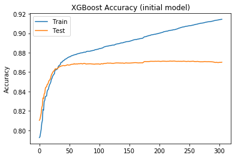


The accuracy on test dataset seems to have stabilized at around 60th epoch. 
```
xgb1_evals_result['validation_1']['auc'][60]
```
It's indeed better for iteration 225. However, we are risking over-fitting. Let's set number of trees to 150. 

### Plot Feature Importance for the initial model
*xgb.plot_importance()* gives an attractively simple bar-chart representing the importance of each feature in our dataset. There are three options for measuring feature importance in XGBoost:
* Weight. The number of times a feature is used to split the data across all trees.
* Cover. The number of times a feature is used to split the data across all trees weighted by the number of training data points that go through those splits.
* Gain. The average training loss reduction gained when using a feature for splitting.
    
The *gain* is the most relevant attribute to interpret the relative importance of each feature. It measures the improvement in accuracy brought by a feature to the branches, and it accounts for a number of categories each variable has (the importance of variables with more categories will not be over-estimated, a problem we may have with the *weight* metric). 

However, analyses (https://towardsdatascience.com/interpretable-machine-learning-with-xgboost-9ec80d148d27) showed that such a widely used method as Gain can lead to inconsistet results. Typically we expect features near the root of the tree to be more important than features split on near the leaves (since trees are constructed greedily). Yet the gain method is biased to attribute more importance to lower splits. As trees get deeper, this bias only grows.
To address this issue, a new approach has been proposed by group of practitioners, described in detail in the paper: (https://papers.nips.cc/paper/7062-a-unified-approach-to-interpreting-model-predictions) and on GitHub: (https://github.com/slundberg/shap)
The summary is that a proof from game theory on the fair allocation of profits leads to a uniqueness result for feature attribution methods in machine learning. These unique values are called Shapley values, after Lloyd Shapley who derived them in the 1950’s. The *SHAP values* used here result from a unification of several individualized model interpretation methods connected to Shapley values. *SHAP (SHapley Additive exPlanations)* is a unified approach to explain the output of any machine learning model. 
According to the authors, Tree SHAP has two properties that any good feature attribution method should follow:
* Consistency. Whenever we change a model such that it relies more on a feature, then the attributed importance for that feature should not decrease.
* Accuracy. The sum of all the feature importances should sum up to the total importance of the model. (For example if importance is measured by the R² value then the attribution to each feature should sum to the R² of the full model). 


```python
# Explain the model's predictions using SHAP values (the mean absolute value of the SHAP values for each feature)
explainer = shap.TreeExplainer(xgb1)
shap_values = explainer.shap_values(X_train)
shap.summary_plot(shap_values, X_train, plot_type="bar")
```


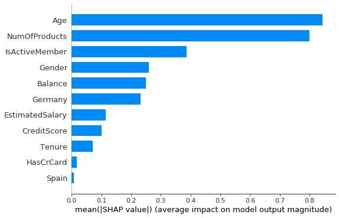


The x-axis of the plot above is essentially the average magnitude change in model output when a feature is “hidden” from the model. We can see that the age feature is actually the most important, followed by the number of products and whether customer is active or not. The graphs suggest we can keep all of the features in the model. I will show other options from the shap package for the final model. 
For comparison, plot *gain* metric. 


```python
# plot of gain
xgb.plot_importance(xgb1, 
                    importance_type='gain', 
                    show_values = False, 
                    xlabel = 'Gain')
```


    <matplotlib.axes._subplots.AxesSubplot at 0x226381c7588>


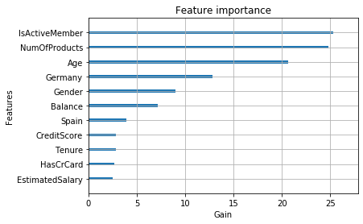


## 3.2 Tune max_depth and min_child_weight

* mean_child_weight (default=1)
For logistic regression it means something like "stop trying to split once you reach a certain degree of purity in a node and your model can fit it". 
Higher values prevent a model from learning relations which might be highly specific to the particular sample selected for a tree, hence it can be used to control over-fitting. 

* max_depth (default=3)
The maximum tree depth each individual tree can grow to. Also used to control over-fitting as higher depth will allow model to learn relations very specific to a particular sample. The default value of 3 is a good starting point, for less complex datasets there shouldn't be a need to go beyond 5. 


```python
# Set number of estimators to 150 (learning from 3.1)
xgb2 =  XGBClassifier(learning_rate =0.1,
                      n_estimators=150,
                      objective= 'binary:logistic',
                      random_state=123)

paramset1 = {'max_depth': [2,3,4,5],
             'min_child_weight':range(1,20,2)}

# Define grid serach with 10-fold cross-validations. 
# The performace will be evaluated on 10 random validation datasets (within training dataset)
gsearch1 = GridSearchCV(estimator = xgb2,
                           param_grid = paramset1,
                           scoring = 'accuracy',
                           cv = 10,
                           n_jobs = -1)

gsearch1 = gsearch1.fit(X_train, y_train)

print('Best parameters values:', gsearch1.best_params_)
print('xgb2: best mean validation accuracy score:', gsearch1.best_score_)
```

    Best parameters values: {'max_depth': 4, 'min_child_weight': 3}
    xgb2: best mean validation accuracy score: 0.867
    

I will set max_depth to 4 and min_child_weight to 3 for further modelling. Increasing min_child_weight is one of the ways we can control over-fitting. 

## 3.3 Tune gamma
Gamma (default=0) is a minimum loss reduction required to make a further partition. Makes the algorithm conservative. The values can vary depending on the loss function and should be tuned. Gamma can take various values but I’ll check for 5 values here: [0.0, 0.1, 0.2, 0.3, 0.4]. 


```python
paramset2 = {'gamma':[i/10.0 for i in range(0,5)]}

# Set parameters according to learning from Step 1 and 2, tune gamma

xgb3 =  XGBClassifier(learning_rate =0.1,
                      n_estimators=150,
                      max_depth = 4, 
                      min_child_weight = 3, 
                      objective= 'binary:logistic',
                      random_state=123)

gsearch2 = GridSearchCV(estimator = xgb3,
                           param_grid = paramset2,
                           scoring = 'accuracy',
                           cv = 10,
                           n_jobs = -1)
gsearch2

gsearch2 = gsearch2.fit(X_train, y_train)

print('Best parameters values:', gsearch2.best_params_)
print('xgb3: best mean validation accuracy score:', gsearch2.best_score_)
```

    Best parameters values: {'gamma': 0.0}
    xgb3: best mean validation accuracy score: 0.867
    

This shows that our original value of gamma, i.e. 0 is the optimum one (which is not suprising, setting it to higher number makes the algorithm conservative) 

## 3.4 Tune subsample and colsample_bytree
* subsample (default=1)
Subsample ratio of the training instances, range: (0,1]. Setting it to 0.5 means that XGBoost would randomly sample half of the training data prior to growing trees, in every boosting iteration. Again, this can prevent overfitting.

* colsample_bytree [default=1]
Denotes the fraction of columns to be randomly sampled for each tree. Another way to avoid overtfitting. 

The next step would be try different subsample and colsample_bytree values. Lets take values 0.6,0.7,0.8,0.9 for both to start with.


```python
paramset3 = {
 'subsample':[i/10.0 for i in range(6,10)],
 'colsample_bytree':[i/10.0 for i in range(6,10)]
}

# Set parameters according to learning from Step 1, 2, 3
xgb4 =  XGBClassifier(learning_rate =0.1,
                      n_estimators=150,
                      max_depth = 4, 
                      min_child_weight = 3,
                      gamma = 0.0, 
                      objective= 'binary:logistic',
                      random_state=123)

gsearch3 = GridSearchCV(estimator = xgb4,
                           param_grid = paramset3,
                           scoring = 'accuracy',
                           cv = 10,
                           n_jobs = -1)

gsearch3 = gsearch3.fit(X_train, y_train)

print('Best parameters values:', gsearch3.best_params_)
print('xgb4: best mean validation accuracy score:', gsearch3.best_score_)
```

    Best parameters values: {'colsample_bytree': 0.7, 'subsample': 0.6}
    xgb4: best mean validation accuracy score: 0.867
    

The results show that using 70% of randomly selected variables for each tree and 60% of training data, subsampled randomly in each iteration, will not have a negative effect on the accuracy of the model, and it can pretend the model from over-fitting.

## 3.5 Tuning regularization parameters
Next step is to apply regularization to reduce overfitting, though many people don’t use these parameters much as gamma provides a substantial way of controlling complexity.

*reg_alpha* and *reg_lambda* control the L1 and L2 regularization terms, which in this case limit how extreme the weights at the leaves can become. These two regularization terms have different effects on the weights: L2 regularization (controlled by the lambda term, analogous to Ridge regression) encourages the weights to be small, 
whereas L1 regularization (controlled by the alpha term, analogous to Lasso regression) encourages sparsity — so it encourages weights to go to 0. This is helpful in models such as logistic regression, where you want some feature selection, but in decision trees we’ve already selected our features, so zeroing their weights isn’t super helpful. L2 regularization can be used in case of very high dimensionality so that the algorithm runs faster when implemented. 
For this reason, I expect setting a high lambda value and a low (or 0) alpha value to be the most effective regularizing strategy.


```python
paramset4 = {
        'reg_alpha': [1e-5, 1e-2, 0.1, 0.2, 0.3],
        'reg_lambda': [1, 2, 5, 10]}

# Set parameters according to learning from previous steps

xgb5 =  XGBClassifier(learning_rate =0.1,
                      n_estimators=150,
                      max_depth = 4, 
                      min_child_weight = 3,
                      gamma = 0.0, 
                      colsample_bytree = 0.7,
                      subsample = 0.6,
                      objective= 'binary:logistic',
                      random_state=123)

gsearch4 = GridSearchCV(estimator = xgb5,
                           param_grid = paramset4,
                           scoring = 'accuracy',
                           cv = 10,
                           n_jobs = -1)

gsearch4 = gsearch4.fit(X_train, y_train)

print('Best parameters values:', gsearch4.best_params_)
print('xgb5: best mean validation accuracy score', gsearch4.best_score_)
```

    Best parameters values: {'reg_alpha': 0.01, 'reg_lambda': 5}
    xgb5: best mean validation accuracy score 0.868
    

Decreasing *reg_alpha* to 0.01 and increasing *reg_lambda* to 5 improves accuracy of the model on a validation dataset. 

## 3.6 Reducing learning rate

Lastly, we should lower the learning rate. Learning rate makes the model more robust by shrinking the weights on each step. Because of the additive nature of gradient boosted trees, getting stuck in local minima is a much smaller problem than with neural networks (or other learning algorithms which use stochastic gradient descent). The smaller the learning_rate the better the accuracy, but for very small values training time increases dramatically, therefore it is suggested to use minimum 0.01 for big datasets. 


```python
paramset5 = {'learning_rate': [0.01, 0.05, 0.1]}

# Set parameters according to learning from all previous steps
xgb6 =  XGBClassifier(n_estimators=150,
                      max_depth = 4, 
                      min_child_weight = 3,
                      gamma = 0.0, 
                      colsample_bytree = 0.7,
                      subsample = 0.6,
                      reg_alpha = 0.01, 
                      reg_lambda = 5, 
                      objective= 'binary:logistic',
                      random_state=123)

gsearch5 = GridSearchCV(estimator = xgb6,
                           param_grid = paramset5,
                           scoring = 'accuracy',
                           cv = 10,
                           n_jobs = -1)

gsearch5 = gsearch5.fit(X_train, y_train)

print('Best parameter values:', gsearch5.best_params_)
print('xgb6: best mean validation accuracy score', gsearch5.best_score_)
gsearch5.cv_results_ 
```

    Best parameter values: {'learning_rate': 0.1}
    xgb6: best mean validation accuracy score 0.868
    


    {'mean_fit_time': array([5.64917104, 4.95855207, 4.10621181]),
     'std_fit_time': array([2.3813094 , 1.81526735, 1.54543428]),
     'mean_score_time': array([0.02774897, 0.02493224, 0.01298015]),
     'std_score_time': array([0.02999428, 0.02684132, 0.00226467]),
     'param_learning_rate': masked_array(data=[0.01, 0.05, 0.1],
                  mask=[False, False, False],
            fill_value='?',
                 dtype=object),
     'params': [{'learning_rate': 0.01},
      {'learning_rate': 0.05},
      {'learning_rate': 0.1}],
     'split0_test_score': array([0.84875, 0.855  , 0.8575 ]),
     'split1_test_score': array([0.85125, 0.87375, 0.88   ]),
     'split2_test_score': array([0.8575, 0.8675, 0.8775]),
     'split3_test_score': array([0.84875, 0.86   , 0.86   ]),
     'split4_test_score': array([0.86875, 0.87625, 0.875  ]),
     'split5_test_score': array([0.86125, 0.86875, 0.8675 ]),
     'split6_test_score': array([0.86625, 0.88625, 0.885  ]),
     'split7_test_score': array([0.84625, 0.85125, 0.85375]),
     'split8_test_score': array([0.85   , 0.84375, 0.85125]),
     'split9_test_score': array([0.86  , 0.8725, 0.8725]),
     'mean_test_score': array([0.855875, 0.8655  , 0.868   ]),
     'std_test_score': array([0.00756327, 0.01222446, 0.01118313]),
     'rank_test_score': array([3, 2, 1])}


The initial learning rate of 0.1 proved to offer the best results, accuracy of 0.868 on validation datasets. With all parameters tuned, I can now test the final model on test dataset. 

## 3.7 Validate the final model on test dataset


```python
xgb_final =  XGBClassifier(n_estimators=300,
                      learning_rate = 0.1,
                      max_depth = 4, 
                      min_child_weight = 3,
                      gamma = 0.0, 
                      colsample_bytree = 0.7,
                      subsample = 0.6,
                      reg_alpha = 0.01, 
                      reg_lambda = 5, 
                      objective= 'binary:logistic',
                      random_state=123)

xgb_final.fit(X_train, y_train, 
         eval_set=[(X_train, y_train), (X_test, y_test)],
         eval_metric='auc',
         early_stopping_rounds = 0.01*(len(X_train)),
         verbose=True)
print(xgb_final)
```

    [0]	validation_0-auc:0.677862	validation_1-auc:0.679682
    Multiple eval metrics have been passed: 'validation_1-auc' will be used for early stopping.
    
    Will train until validation_1-auc hasn't improved in 80.0 rounds.
    [1]	validation_0-auc:0.799895	validation_1-auc:0.79536
    [2]	validation_0-auc:0.849735	validation_1-auc:0.846519
    [3]	validation_0-auc:0.860691	validation_1-auc:0.858777
    [4]	validation_0-auc:0.862332	validation_1-auc:0.863164
    [5]	validation_0-auc:0.859583	validation_1-auc:0.861815
    [6]	validation_0-auc:0.859013	validation_1-auc:0.864563
    [7]	validation_0-auc:0.858057	validation_1-auc:0.862517
    [8]	validation_0-auc:0.857112	validation_1-auc:0.861024
    [9]	validation_0-auc:0.860114	validation_1-auc:0.861839
    [10]	validation_0-auc:0.862718	validation_1-auc:0.863852
    [11]	validation_0-auc:0.863377	validation_1-auc:0.864743
    [12]	validation_0-auc:0.863092	validation_1-auc:0.864903
    [13]	validation_0-auc:0.863595	validation_1-auc:0.864581
    [14]	validation_0-auc:0.862319	validation_1-auc:0.86406
    [15]	validation_0-auc:0.864385	validation_1-auc:0.864109
    [16]	validation_0-auc:0.863489	validation_1-auc:0.863182
    [17]	validation_0-auc:0.863435	validation_1-auc:0.863352
    [18]	validation_0-auc:0.864058	validation_1-auc:0.863983
    [19]	validation_0-auc:0.865027	validation_1-auc:0.864241
    [20]	validation_0-auc:0.866084	validation_1-auc:0.864982
    [21]	validation_0-auc:0.867145	validation_1-auc:0.866345
    [22]	validation_0-auc:0.86755	validation_1-auc:0.866236
    [23]	validation_0-auc:0.869175	validation_1-auc:0.866967
    [24]	validation_0-auc:0.870171	validation_1-auc:0.86794
    [25]	validation_0-auc:0.870196	validation_1-auc:0.867411
    [26]	validation_0-auc:0.871676	validation_1-auc:0.868177
    [27]	validation_0-auc:0.87169	validation_1-auc:0.868635
    [28]	validation_0-auc:0.871883	validation_1-auc:0.868786
    [29]	validation_0-auc:0.871835	validation_1-auc:0.86836
    [30]	validation_0-auc:0.872809	validation_1-auc:0.868756
    [31]	validation_0-auc:0.872828	validation_1-auc:0.868582
    [32]	validation_0-auc:0.873836	validation_1-auc:0.869182
    [33]	validation_0-auc:0.875124	validation_1-auc:0.869748
    [34]	validation_0-auc:0.875555	validation_1-auc:0.869687
    [35]	validation_0-auc:0.87634	validation_1-auc:0.870407
    [36]	validation_0-auc:0.876056	validation_1-auc:0.869928
    [37]	validation_0-auc:0.87604	validation_1-auc:0.869867
    [38]	validation_0-auc:0.876457	validation_1-auc:0.869685
    [39]	validation_0-auc:0.877104	validation_1-auc:0.869806
    [40]	validation_0-auc:0.877681	validation_1-auc:0.870091
    [41]	validation_0-auc:0.877859	validation_1-auc:0.870471
    [42]	validation_0-auc:0.878661	validation_1-auc:0.871461
    [43]	validation_0-auc:0.878912	validation_1-auc:0.871387
    [44]	validation_0-auc:0.879616	validation_1-auc:0.871434
    [45]	validation_0-auc:0.879742	validation_1-auc:0.871198
    [46]	validation_0-auc:0.879803	validation_1-auc:0.871233
    [47]	validation_0-auc:0.880104	validation_1-auc:0.871203
    [48]	validation_0-auc:0.880608	validation_1-auc:0.870995
    [49]	validation_0-auc:0.881146	validation_1-auc:0.870654
    [50]	validation_0-auc:0.881487	validation_1-auc:0.870673
    [51]	validation_0-auc:0.881351	validation_1-auc:0.870833
    [52]	validation_0-auc:0.881712	validation_1-auc:0.871203
    [53]	validation_0-auc:0.882014	validation_1-auc:0.871126
    [54]	validation_0-auc:0.882074	validation_1-auc:0.871183
    [55]	validation_0-auc:0.882259	validation_1-auc:0.87128
    [56]	validation_0-auc:0.882413	validation_1-auc:0.871186
    [57]	validation_0-auc:0.882578	validation_1-auc:0.871248
    [58]	validation_0-auc:0.882745	validation_1-auc:0.871114
    [59]	validation_0-auc:0.882954	validation_1-auc:0.871088
    [60]	validation_0-auc:0.883079	validation_1-auc:0.871097
    [61]	validation_0-auc:0.883578	validation_1-auc:0.871129
    [62]	validation_0-auc:0.883981	validation_1-auc:0.871428
    [63]	validation_0-auc:0.884112	validation_1-auc:0.871361
    [64]	validation_0-auc:0.88426	validation_1-auc:0.871266
    [65]	validation_0-auc:0.884834	validation_1-auc:0.871627
    [66]	validation_0-auc:0.885974	validation_1-auc:0.8722
    [67]	validation_0-auc:0.886619	validation_1-auc:0.871846
    [68]	validation_0-auc:0.887281	validation_1-auc:0.871807
    [69]	validation_0-auc:0.887696	validation_1-auc:0.872193
    [70]	validation_0-auc:0.88799	validation_1-auc:0.872305
    [71]	validation_0-auc:0.888186	validation_1-auc:0.872439
    [72]	validation_0-auc:0.88893	validation_1-auc:0.872375
    [73]	validation_0-auc:0.889592	validation_1-auc:0.872111
    [74]	validation_0-auc:0.889793	validation_1-auc:0.872099
    [75]	validation_0-auc:0.890332	validation_1-auc:0.872634
    [76]	validation_0-auc:0.890553	validation_1-auc:0.872452
    [77]	validation_0-auc:0.890618	validation_1-auc:0.87243
    [78]	validation_0-auc:0.891218	validation_1-auc:0.872996
    [79]	validation_0-auc:0.891526	validation_1-auc:0.872526
    [80]	validation_0-auc:0.891951	validation_1-auc:0.872467
    [81]	validation_0-auc:0.892192	validation_1-auc:0.872438
    [82]	validation_0-auc:0.892407	validation_1-auc:0.872402
    [83]	validation_0-auc:0.892489	validation_1-auc:0.872285
    [84]	validation_0-auc:0.892866	validation_1-auc:0.87237
    [85]	validation_0-auc:0.893109	validation_1-auc:0.872345
    [86]	validation_0-auc:0.893417	validation_1-auc:0.872396
    [87]	validation_0-auc:0.893496	validation_1-auc:0.872109
    [88]	validation_0-auc:0.893892	validation_1-auc:0.87202
    [89]	validation_0-auc:0.894275	validation_1-auc:0.871718
    [90]	validation_0-auc:0.89489	validation_1-auc:0.872086
    [91]	validation_0-auc:0.895187	validation_1-auc:0.871826
    [92]	validation_0-auc:0.895404	validation_1-auc:0.87183
    [93]	validation_0-auc:0.89559	validation_1-auc:0.87179
    [94]	validation_0-auc:0.895808	validation_1-auc:0.871952
    [95]	validation_0-auc:0.896022	validation_1-auc:0.872052
    [96]	validation_0-auc:0.896326	validation_1-auc:0.872017
    [97]	validation_0-auc:0.896331	validation_1-auc:0.872116
    [98]	validation_0-auc:0.896634	validation_1-auc:0.871972
    [99]	validation_0-auc:0.896762	validation_1-auc:0.872046
    [100]	validation_0-auc:0.897103	validation_1-auc:0.871579
    [101]	validation_0-auc:0.897267	validation_1-auc:0.871332
    [102]	validation_0-auc:0.897364	validation_1-auc:0.87129
    [103]	validation_0-auc:0.897528	validation_1-auc:0.871286
    [104]	validation_0-auc:0.897609	validation_1-auc:0.871127
    [105]	validation_0-auc:0.897672	validation_1-auc:0.87128
    [106]	validation_0-auc:0.897885	validation_1-auc:0.871256
    [107]	validation_0-auc:0.89791	validation_1-auc:0.871459
    [108]	validation_0-auc:0.89813	validation_1-auc:0.871721
    [109]	validation_0-auc:0.898328	validation_1-auc:0.871804
    [110]	validation_0-auc:0.898357	validation_1-auc:0.871815
    [111]	validation_0-auc:0.898558	validation_1-auc:0.871784
    [112]	validation_0-auc:0.898853	validation_1-auc:0.871451
    [113]	validation_0-auc:0.899123	validation_1-auc:0.871568
    [114]	validation_0-auc:0.899174	validation_1-auc:0.871861
    [115]	validation_0-auc:0.89944	validation_1-auc:0.871915
    [116]	validation_0-auc:0.89965	validation_1-auc:0.871997
    [117]	validation_0-auc:0.89982	validation_1-auc:0.871847
    [118]	validation_0-auc:0.90005	validation_1-auc:0.871809
    [119]	validation_0-auc:0.900214	validation_1-auc:0.871628
    [120]	validation_0-auc:0.900419	validation_1-auc:0.871605
    [121]	validation_0-auc:0.900647	validation_1-auc:0.871681
    [122]	validation_0-auc:0.900898	validation_1-auc:0.871482
    [123]	validation_0-auc:0.900914	validation_1-auc:0.871566
    [124]	validation_0-auc:0.901163	validation_1-auc:0.871611
    [125]	validation_0-auc:0.90133	validation_1-auc:0.871725
    [126]	validation_0-auc:0.901419	validation_1-auc:0.871804
    [127]	validation_0-auc:0.901708	validation_1-auc:0.871762
    [128]	validation_0-auc:0.902274	validation_1-auc:0.871698
    [129]	validation_0-auc:0.902512	validation_1-auc:0.871477
    [130]	validation_0-auc:0.902621	validation_1-auc:0.871565
    [131]	validation_0-auc:0.902668	validation_1-auc:0.87138
    [132]	validation_0-auc:0.902781	validation_1-auc:0.8714
    [133]	validation_0-auc:0.902999	validation_1-auc:0.871423
    [134]	validation_0-auc:0.903253	validation_1-auc:0.871804
    [135]	validation_0-auc:0.903297	validation_1-auc:0.871758
    [136]	validation_0-auc:0.903506	validation_1-auc:0.872063
    [137]	validation_0-auc:0.903842	validation_1-auc:0.872137
    [138]	validation_0-auc:0.904338	validation_1-auc:0.871545
    [139]	validation_0-auc:0.904472	validation_1-auc:0.871628
    [140]	validation_0-auc:0.904657	validation_1-auc:0.871438
    [141]	validation_0-auc:0.905008	validation_1-auc:0.87132
    [142]	validation_0-auc:0.905328	validation_1-auc:0.871529
    [143]	validation_0-auc:0.905588	validation_1-auc:0.871411
    [144]	validation_0-auc:0.905927	validation_1-auc:0.871399
    [145]	validation_0-auc:0.906012	validation_1-auc:0.871371
    [146]	validation_0-auc:0.906137	validation_1-auc:0.871631
    [147]	validation_0-auc:0.906183	validation_1-auc:0.871722
    [148]	validation_0-auc:0.906353	validation_1-auc:0.871858
    [149]	validation_0-auc:0.906494	validation_1-auc:0.871826
    [150]	validation_0-auc:0.906578	validation_1-auc:0.871713
    [151]	validation_0-auc:0.906849	validation_1-auc:0.871647
    [152]	validation_0-auc:0.907016	validation_1-auc:0.871565
    [153]	validation_0-auc:0.907321	validation_1-auc:0.871876
    [154]	validation_0-auc:0.907504	validation_1-auc:0.871864
    [155]	validation_0-auc:0.907775	validation_1-auc:0.871645
    [156]	validation_0-auc:0.907903	validation_1-auc:0.871779
    [157]	validation_0-auc:0.908117	validation_1-auc:0.871901
    [158]	validation_0-auc:0.908298	validation_1-auc:0.871823
    Stopping. Best iteration:
    [78]	validation_0-auc:0.891218	validation_1-auc:0.872996
    
    XGBClassifier(base_score=0.5, booster='gbtree', colsample_bylevel=1,
                  colsample_bynode=1, colsample_bytree=0.7, gamma=0.0,
                  learning_rate=0.1, max_delta_step=0, max_depth=4,
                  min_child_weight=3, missing=None, n_estimators=300, n_jobs=1,
                  nthread=None, objective='binary:logistic', random_state=123,
                  reg_alpha=0.01, reg_lambda=5, scale_pos_weight=1, seed=None,
                  silent=None, subsample=0.6, verbosity=1)
    

Accuracy on test dataset has increased from **0.8714** with the initial model to **0.8730** for the final model. We have achieved this result after fitting 78 trees (*Best iteration: [78]*)


```python
# Visualize training - how AUC improved for training and test dataset
xgb_final_evals_result = xgb_final.evals_result()
epochs = len(xgb_final_evals_result['validation_0']['auc'])
x_axis = range(0, epochs)

fig, ax = plt.subplots()
ax.plot(x_axis, xgb_final_evals_result['validation_0']['auc'], label='Train')
ax.plot(x_axis, xgb_final_evals_result['validation_1']['auc'], label='Test')
ax.legend()
plt.ylabel('Accuracy')
plt.title('XGBoost Accuracy: final model')
plt.show()
```


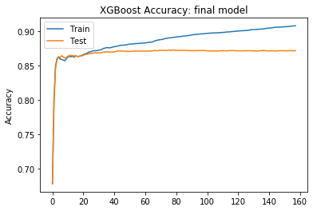


## 3.8 Save final model to a file


```python
xgb_forsave =  XGBClassifier(n_estimators=78,
                      learning_rate = 0.1,
                      max_depth = 4, 
                      min_child_weight = 3,
                      gamma = 0.0, 
                      colsample_bytree = 0.7,
                      subsample = 0.6,
                      reg_alpha = 0.01, 
                      reg_lambda = 5, 
                      objective= 'binary:logistic',
                      random_state=123)

xgb_forsave.fit(X_train, y_train, verbose=True)

# Save the final XGBoost model to x.dat pickle file in the current working directory.
pickle.dump(xgb_forsave, open('xgb_churn.dat', "wb"))
```

After a good night's sleep you may want to load the model and understand its predictions!


```python
loaded_model = pickle.load(open('xgb_churn.dat', "rb"))
print(loaded_model)
```

    XGBClassifier(base_score=0.5, booster='gbtree', colsample_bylevel=1,
                  colsample_bynode=1, colsample_bytree=0.7, gamma=0.0,
                  learning_rate=0.1, max_delta_step=0, max_depth=4,
                  min_child_weight=3, missing=nan, n_estimators=78, n_jobs=1,
                  nthread=None, objective='binary:logistic', random_state=123,
                  reg_alpha=0.01, reg_lambda=5, scale_pos_weight=1, seed=None,
                  silent=None, subsample=0.6, verbosity=1)
    

# 4. Interpretation of the model
I will explain some of the model's predictions on the entire dataset using the *shap* library. 
## 4.1 Global feature importance


```python
# Plot Feature Importance (SHAP values)
explainer = shap.TreeExplainer(loaded_model)
shap_values = explainer.shap_values(X)
shap.summary_plot(shap_values, X, plot_type="bar")
```


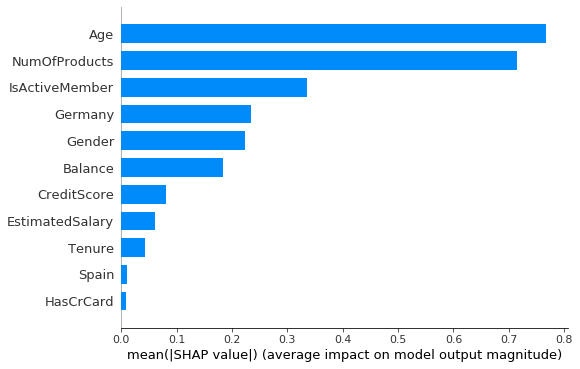


The x-axis is essentially the average magnitude change in model output when a feature is "hidden" from the model. We can see that the age feature is the strongest predictor of churn, followed by the number of products and (well behind) whether customer is active or not.

A bit more information can be extracted from a density scatter plot of SHAP values for each feature. It can be used to identify how much impact each feature has on the model output for individuals. In the plot below every customer has one dot on each row. Dots that don’t fit on the row pile up to show density. Since the XGBoost model has a logistic loss the x-axis has units of log-odds (Tree SHAP explains the change in the margin output of the model). The x position of the dot is the impact of that feature on the model’s prediction for the customer, and the color of the dot represents the value of that feature for the customer. The coloring by feature value shows us patterns such as how being older and not being active member increases chance of churn. An interesting pattern can be observed for number of products: while it is not the most important feature globally, it is by far the most important feature for a subset of customers, and high number of products decrease the chances of churn for some people, but can also increase for others. Hence, by plotting the impact of a feature on every sample we can also see important outlier effects.


```python
shap.summary_plot(shap_values, X)
```


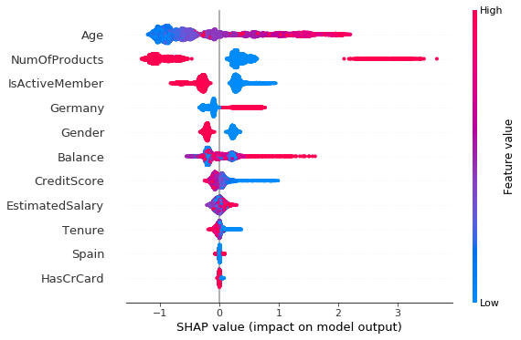


Since SHAP values represent a feature's responsibility for a change in the model output, the plot represents the change in probability of churn as number of products changes. Vertical dispersion at a single value of RM represents interaction effects with other features. To help reveal these interactions dependence_plot automatically selects another feature for coloring. I will discuss it for a plot of age and being active/inactive member. 


```python
shap.dependence_plot("Age", shap_values, X)
```


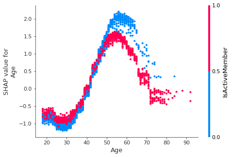


The risk of churn reaches its peak for 50-60 year olds and among this group is higher for people who are not active members. However, among the youngest being an active member decreases the chances of churn *to a lesser extent* than being an inactive member. We found that people in their 20s and 30s and least likely to leave, in partuclar those who are not an active member (of the club/bank, whatever), while being 50-60 and inactive is a strong predictor of churn.  

Fast exact computation of pairwise interactions are implemented for tree models with *shap.TreeExplainer(model).shap_interaction_values(X)*. This returns a matrix for every prediction, where the main effects are on the diagonal and the interaction effects are off-diagonal. These values often reveal interesting hidden relationships. *shap_interaction_values* can be also used in dependence_plot. The one below involving age and number of products shows that the relationship between risk of churn and age varies for customers with different number of products in a bank. 


```python
shap_interaction_values = explainer.shap_interaction_values(X)
shap.dependence_plot(
    ("Age", "NumOfProducts"),
    shap_interaction_values, X,
    display_features=X)
```


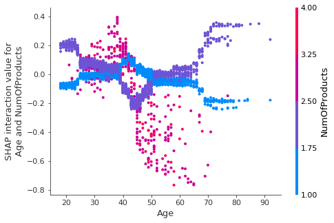


I have also observed an increased value for interaction effect for Balance and Tenure, which is visualized below. 


```python
shap.dependence_plot(
    ("Balance", "Tenure"),
    shap_interaction_values, X,
    display_features=X)
```


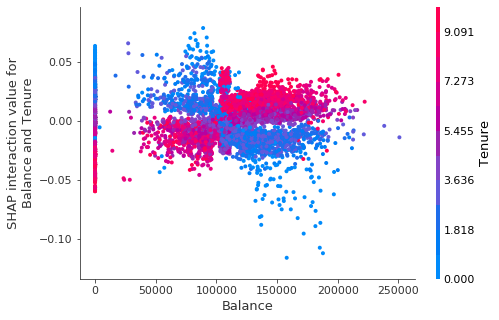


## 4.2 Individual case prediction interpretation
With shap package we can also plot the feature importance for every customer in our data set since we have individualized explanations for every person. To understand how features are contributing to a prediction of each customer, we can use *shap.force_plot()* (use *matplotlib=True* to avoid Javascript. Otherwise, call: *shap.initjs()* first)


```python
shap.force_plot(explainer.expected_value, shap_values[0,:], X.iloc[0,:], matplotlib=True )
```


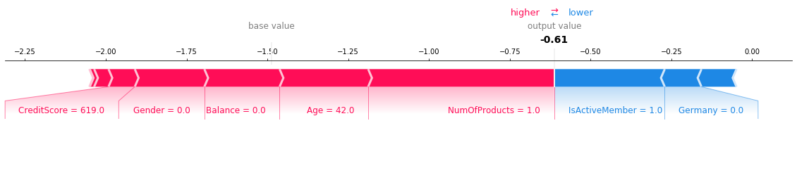


The above explanation shows features each contributing to push the model output from the base value (the average model output over the dataset we passed) to the model output. Features pushing the prediction (-0.61 in this case) higher are shown in red, those pushing the prediction lower are in blue. E.g. Having just one product, being 42, and a few other factors increased this customer's predicted probability of churn, but the fact that he/she is from Germany and is an active member pushed it down to -0.61 (below average model output from the whole dataset). 
For comparison, look at case no 2. 


```python
shap.force_plot(explainer.expected_value, shap_values[1,:], X.iloc[1,:], matplotlib=True )
```


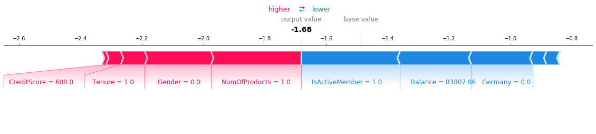


## 4.3 Plot boosted tree
XGBoost model is a linear combination of decision trees. To make a prediction xgboost calculates predictions of individual trees and adds them. Therefore, you can interpret xgboost model by interpreting individual trees. 


```python
# This plots the first tree in the model (the tree at index 0)
xgb.to_graphviz(loaded_model)
```


```python
# This plots the last tree in the model (the tree at index 77)
xgb.to_graphviz(loaded_model, num_trees = 77)
```


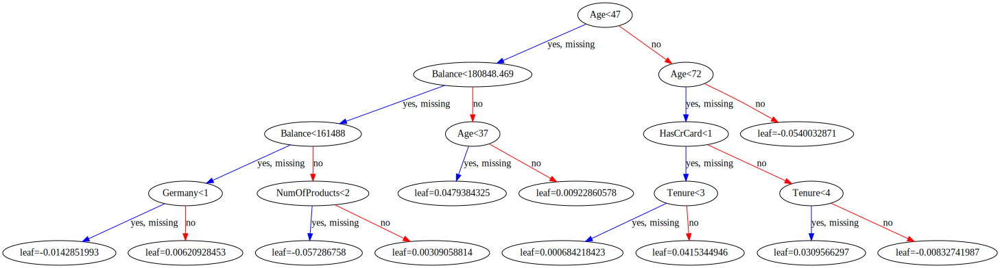


